# 🎨 CSS Layout Masterclass: Padding, Margin, & Flexbox

**Student Project | Frontend Development Lab**

This repository contains a complete laboratory exploring the foundations of CSS layout. The project moves from the basic **Box Model** (how items sit on a page) to advanced **Flexbox** interactions (how items relate to each other).

---

## 📌 Project Overview
This lab consists of **20 interactive tasks** designed to diagnose and solve common layout problems.
- **Goal:** To visualize "invisible" CSS properties like margin and padding.
- **Outcome:** A responsive, maintainable layout system.

---

## 🟢 SECTION A: Foundations (The Box Model)
*Building the concept through observation.*

### Task 1: Content vs Padding
**Analysis:** Padding adds space *inside* the border. It increases the visible size of the element (in the standard box model) and pushes nearby elements away.
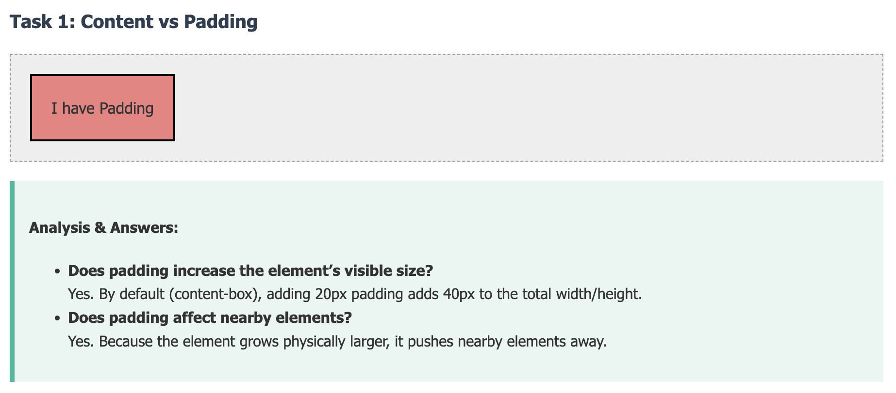

### Task 2: Content vs Margin
**Analysis:** Margin adds space *outside* the border. It creates "personal space" between elements but does not accept background colors.
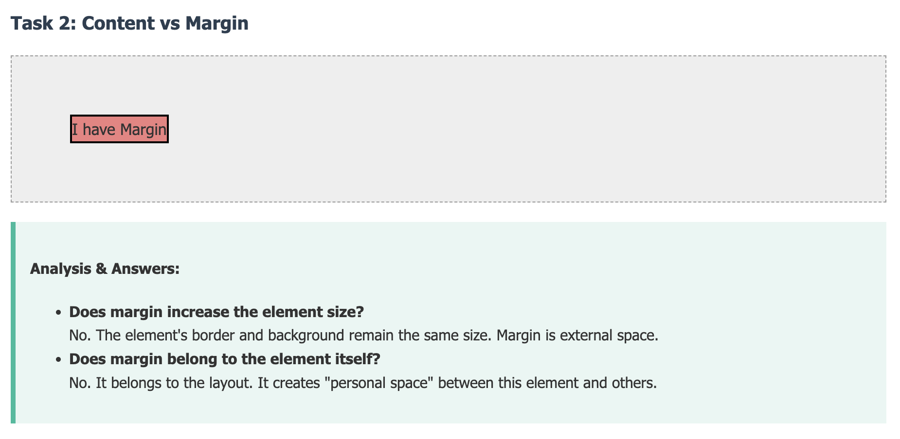

### Task 3: Padding vs Margin Background
**Analysis:** This experiment proves that background colors extend into the Padding but stop at the Border. Margins are always transparent.
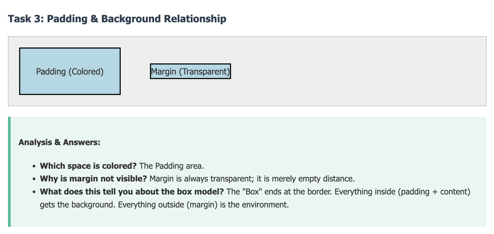

### Task 4: Side-Specific Spacing
**Analysis:** Demonstration of longhand properties (`padding-top`) vs shorthand (`padding: 10px 20px`) for cleaner code.
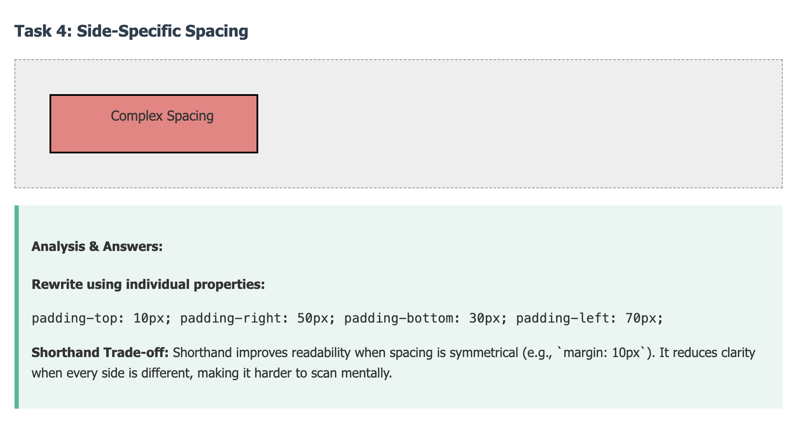

### Task 5: Invalid & Extreme Values
**Analysis:**
- **Padding:** Cannot be negative (a box cannot be smaller than its contents).
- **Margin:** Can be negative (used for overlapping elements or "bleed" layouts).

---

## 🔵 SECTION B: Layout Interaction
*How elements push and pull against each other.*

### Task 6: Margin Collapse
**Analysis:** When two vertical margins touch (e.g., Bottom 50px and Top 30px), they do not add up to 80px. The larger one (50px) wins. This is a common source of layout bugs.
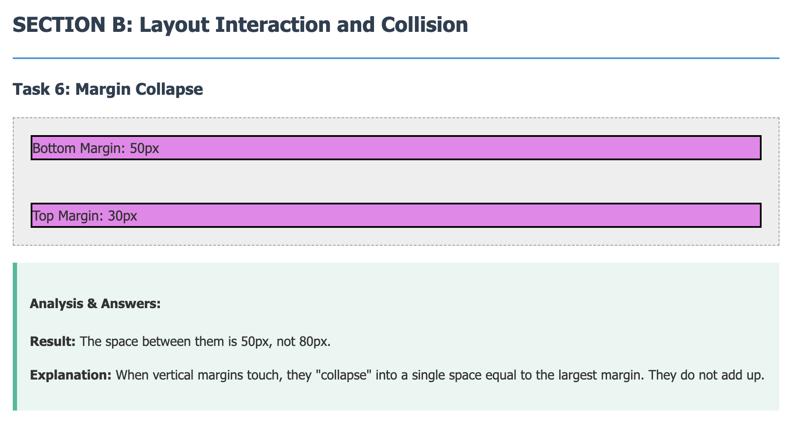

### Task 7: Inline vs Block Elements
**Analysis:** Inline elements (like ``) ignore top/bottom margins to preserve the flow of text paragraphs. Block elements respect all spacing.
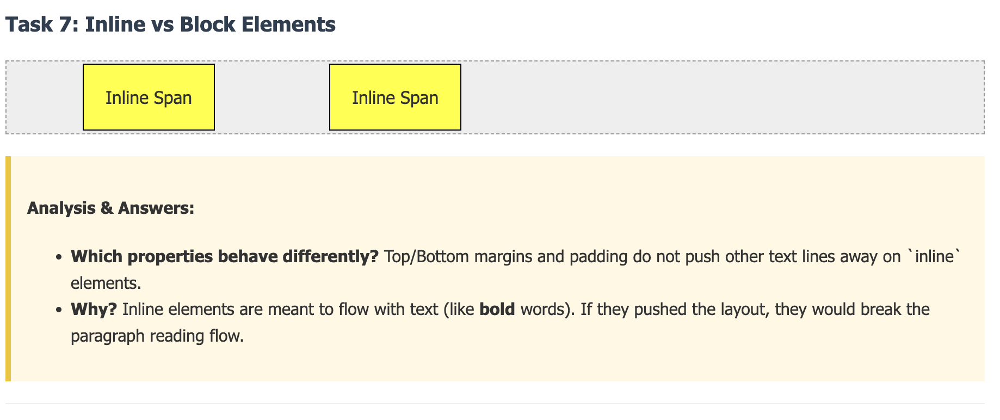

---

## 🟣 SECTION C: Introduction to Flexbox
*Moving from block layout to flexible contexts.*

### Task 8: Why Flex Exists
**Analysis:** Applying `display: flex` immediately solves three problems:
1. Aligns items horizontally (row).
2. Shrinks items to fit content.
3. Stretches items to equal height.
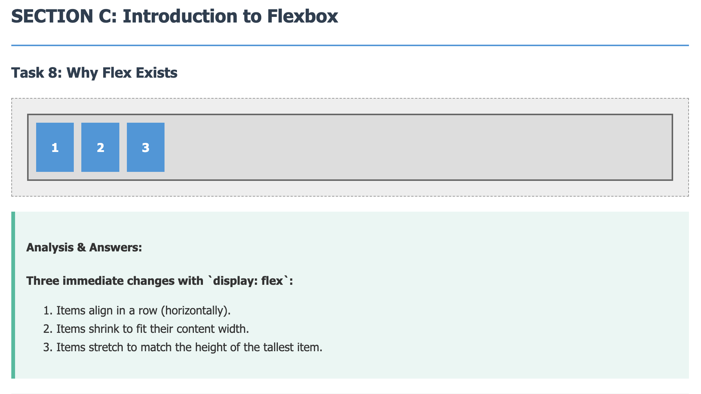

### Task 9: Padding Inside Flex Items
**Analysis:** Padding affects the size of the individual flex item but does not break the flex alignment row.
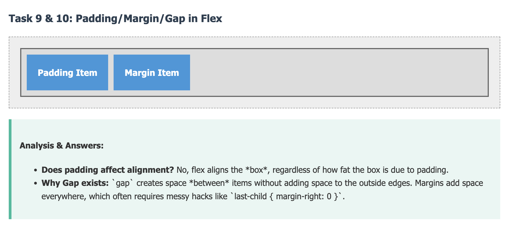

### Task 10: Margin vs Gap
**Analysis:** `gap` is superior to margin for separating items because it only adds space *between* items, not on the outside edges.

### Task 11: Main Axis vs Cross Axis
**Analysis:** Changing `flex-direction` to `column` rotates the Main Axis. This is crucial for understanding why `justify-content` aligns vertically in columns.
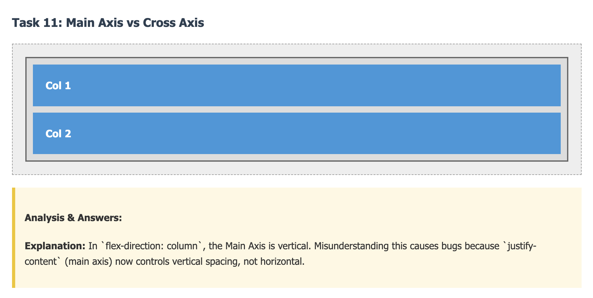

---

## 🟠 SECTION D: Control and Alignment

### Task 12: justify-content vs margin
**Analysis:** Controlling spacing via the parent container (`justify-content: space-between`) creates a responsive layout that adapts to screen size, unlike fixed margins.
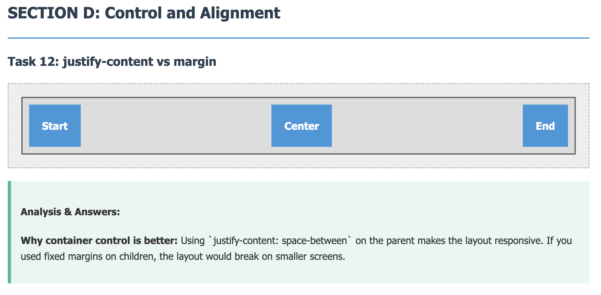

### Task 13: align-items
**Analysis:** Flexbox easily centers items of different heights, removing the need for "magic number" padding adjustments.
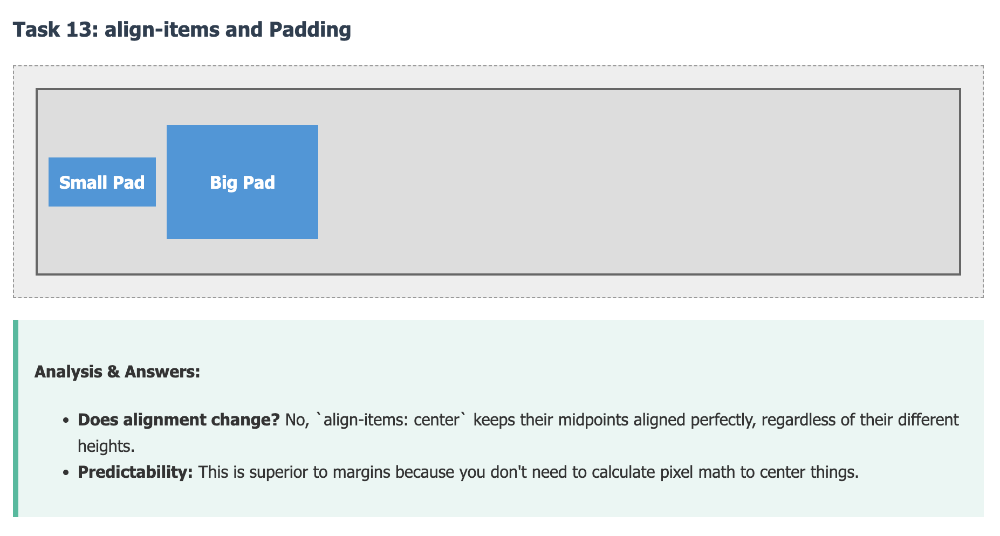

### Task 14: Auto Margin in Flex
**Analysis:** In Flexbox, `margin-left: auto` eats up all available empty space, effectively pushing the element to the far right (perfect for Navbars).
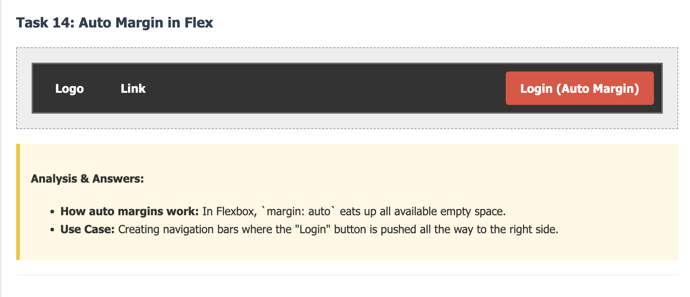

---

## 🔴 SECTION E: Design Decision Making

### Task 15 & 16: Button Design & Card Component
**Analysis:**
- **Buttons:** Padding is used to increase the clickable area for accessibility.
- **Cards:** Padding creates internal breathing room; Margin separates the card from other elements.
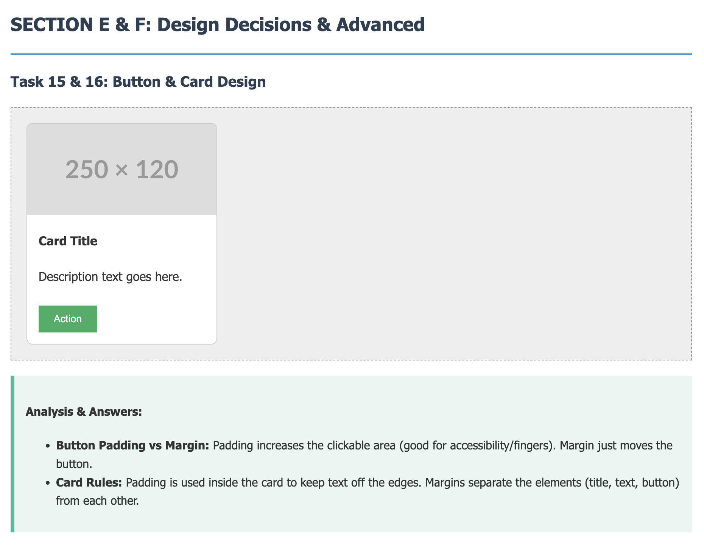
*(Note: Task 15 and 16 are combined in the image above)*

### Task 17: Box Size Illusion
**Analysis:** A box with large padding looks significantly larger than a box with large margin, even if they technically take up similar amounts of layout space.

---

## 🟤 SECTION F: Advanced Thinking

### Task 18 & 19: Box Sizing & Vertical Centering
**Analysis:**
- **Task 18:** `box-sizing: border-box` fixes the overflow bug by making padding subtract from the width rather than add to it.
- **Task 19:** `margin: auto` fails to center vertically in block layout. Flexbox (`align-items: center`) is the modern, reliable solution.
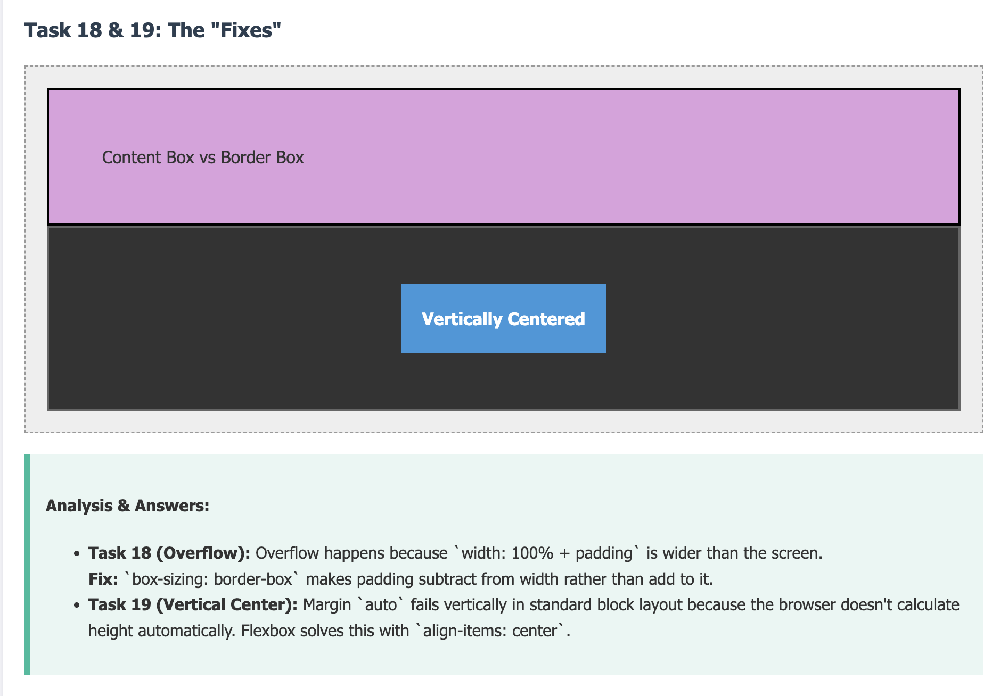
*(Note: Task 18 and 19 are combined in the image above)*

### Task 20: The Golden Rules
**Analysis:** A summary of best practices, such as avoiding padding for separation and using Flexbox for all alignment tasks.
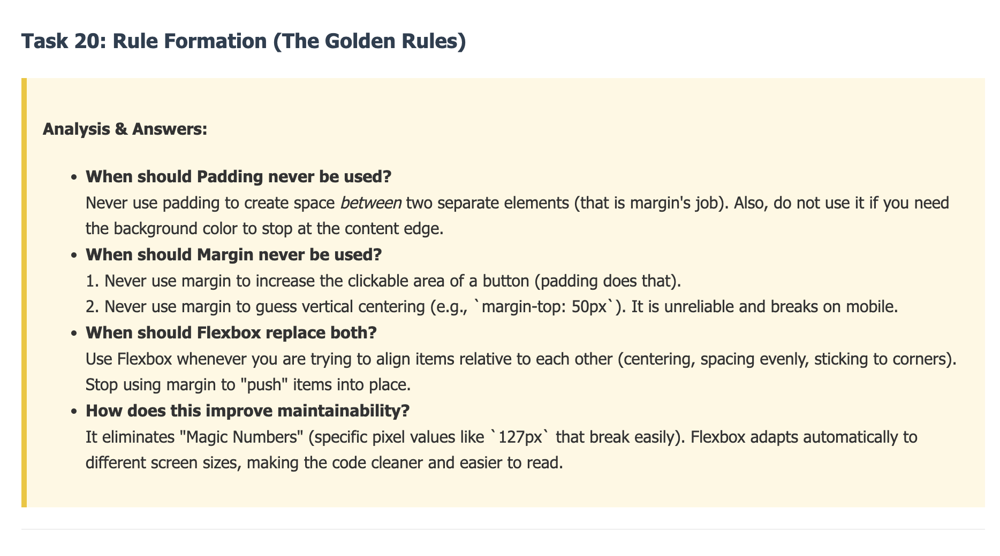

---
*Lab completed by Aaryan*